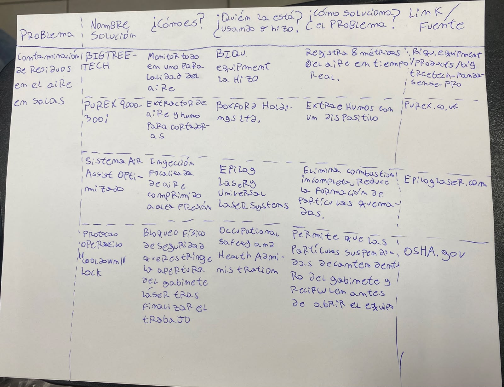
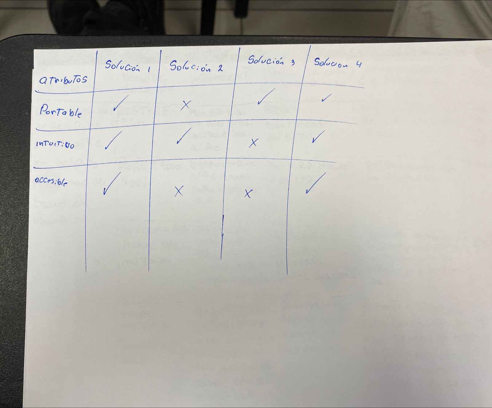
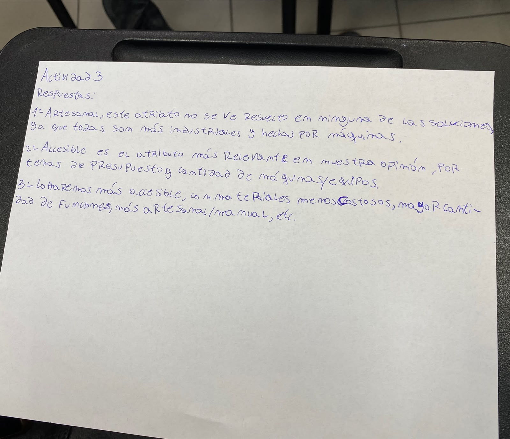
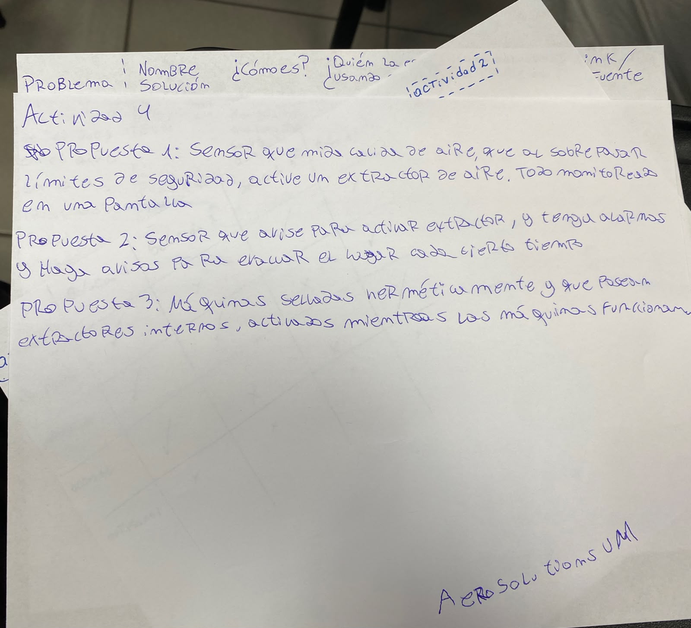

#Inicio de la clase

Se nos explico el motivo por el cual la salida al hub de providencia habia sido cancelada y se reprogramo para la siguiente semana.
Se hizo enfasis en que los grupos los cuales tuvieran el problema relacionado al hub deberian ir a visitarlo como USUARIO y no como estudiante.
Se nos presento y enseño 2 nuevos conceptos los cuales eran estado del arte y benchmark.

#Actividad 1

La actividad 1 consiste en realizar un estado del arte sobre nuestro proyecto, buscando soluciones que se encuentren hechas y por ebde esten en el mercado.

#Actividad 2

La actividad 2 consiste en realizar un benchmark usando las mismas soluciones que encontramos en la actividad 1, los atributos utilizados en este benchmark fueron entregados por la profesora de los cuales nosotros debiamos. utilizar minimo 3

#Actividad 3

La actividad 3 consiste en responder 3 preguntas en base al benchmark realizado previamente y tambien pensando en nuestro proyecto/trabajo.

#Actividad 4

La actividad 4 consiste en una lluvia de ideas utilizando lo "aprendido"/investigado del estado del arte de la actividad 1 y el benchmark de la actividad 2, se debian entregar un total de 3 ideas que debian ser logicas.
La idea es que al final nos quedemos con una de las 3 ideas propuestas en esta etapa

